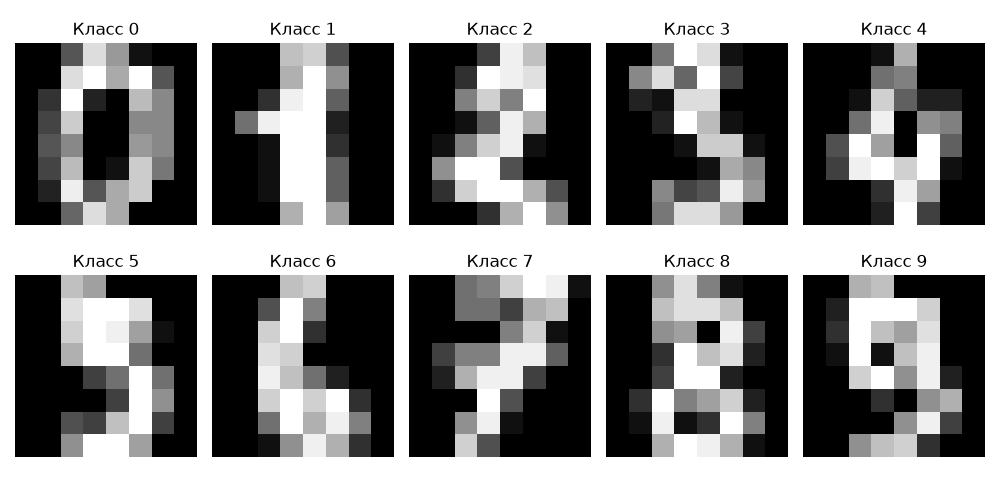
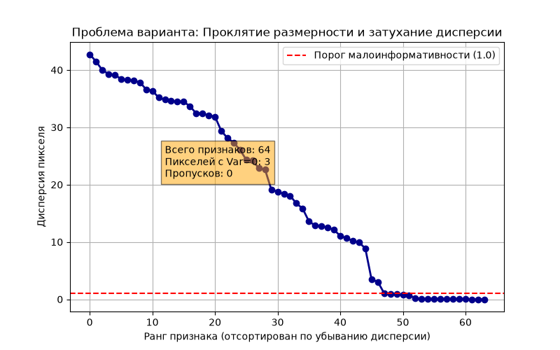

# Отчет по Лабораторной работе №1
**Вариант:** 16 (Digits, размерность)  
**Работа:** №1. Git-окружение, прекоммитные проверки и EDA варианта  
**Дата:** 25.09.2026  
**Автор:** [Сергей_Старков]  
**Хеш коммита кода:** [8566743]  
**Хеш данных (digits.csv):** 6e928524d187dc6e37051cde0cc17102b517fd86fae6eb3aab6b83b1bf98e729  

---

## 1. Паспорт данных
* **Источник:** Выборка `sklearn.datasets.load_digits` (копия тестового подмножества базы данных UCI Optical Recognition of Handwritten Digits).
* **Лицензия:** BSD 3-Clause License.
* **Объем:** Полный размер загруженного датасета составляет 1797 объектов.
* **Поля:** `pixel_0` ... `pixel_63` (целочисленные значения интенсивности от 0 до 16), а также столбец `target` (целевой класс от 0 до 9).
* **План разбиения:** В последующих работах для сохранения репрезентативности классов будет использоваться StratifiedKFold разбиение на 5 фолдов.

## 2. Сводки EDA (Профиль P2)
Расчеты выполнены скриптом `src/features/eda.py`. Полные машиночитаемые метрики зафиксированы в файлах `reports/LAB1/eda_stats.csv` и `reports/LAB1/class_distribution.csv`.
* Пропуски (NaN) в данных полностью отсутствуют.
* Аномальные значения (выходящие за границы диапазона) отсутствуют.
* Дисбаланс классов отсутствует: каждый из 10 классов занимает стабильную долю около 10% от общего объема данных (минимум 174 объекта у класса 8, максимум 183 объекта у класса 3).

## 3. Графики результатов и проблемы варианта
Ниже приведены обязательный по профилю P2 график примеров сетки классов и график проблемы варианта — проклятия размерности.

## 4. Нумерованные выводы (Критерий: одно число на каждый пункт)
1. Набор данных содержит ровно **1797** записей.
2. Целевая переменная размечена ровно на **10** сбалансированных классов.
3. Пространство признаков содержит ровно **64** численных параметра.
4. Из всех доступных признаков ровно **3** пикселя имеют абсолютно нулевую дисперсию (`variance = 0.0`).
5. Ровно **4** пикселя обладают дисперсией ниже установленного порога информативности 1.0.
6. Выводы отчета полностью и детерминированно воспроизводятся повторным прогоном скрипта `python -m src.features.eda`.
